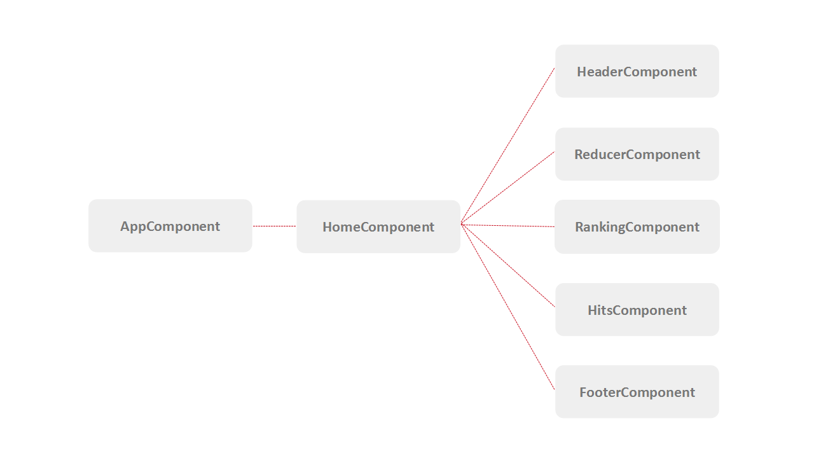

# Project Frontend Intern Challenge

Desenvolvimento de uma landing page simulando um encurtador de links utilizando: 

- Angular2
- TypeScript
- Bootstrap

## Instruções para execução

No diretório do project, instale os módulos utilizando o comando `npm install`. Assim que eles forem instalados, é possível rodar o servidor de teste utilizando o comando `ng serve` e acessá-lo através do link `http://localhost:4200/`.

**NOTE: NodeJS  versão 6.9.5    NPM     versão 4.2.0**

## Estrutura dos Componentes

Seguindo os princípios de modularização do Angular2, a landing page foi organizada em diferentes componentes como é possível ver na figura a seguir. 



## Estrutura dos Arquivos

A estrutura de diretórios foi estabelecida com o objetivo de encapsular os componentes em seus respectivos módulos. Cada diretório do componente contém o html, scss, ts para esse componente. 

```
└── src
    └── app                         -- root              component
       ├── components 
       │    ├── footer              -- footer            component
       │    ├── header              -- header            component
       │    ├── hits-container      -- hits-container    component
       │    ├── pages               -- pages             component
       │    ├── ranking             -- ranking           component
       │    ├── reducer             -- reducer           component
       │    └── shared              -- shared            service, class
       └── assets                   -- assets            global variables, images, json 
```

O diretório de shared possui serviços que podem ser compartilhados por diversos componentes (nesta aplicação em específico, para serviços de coleta de dados a partir do arquivo de json disponibilizado).

A pasta de assets contém os recursos utilizadas na aplicação como as imagens, o arquivo json com as urls reduzidas e o arquivo de variables com as variáveis globais utilizadas na estilização dos componentes.

# Funcionalidades

Algumas dúvidas surgiram quanto ao escopo das funcionalidades necessárias e suas ações. Nesta implementação a funcionalidade principal é reduzir a url passada por parâmetro. Para realizar esta tarefa utilizei um método trivial que aplica uma codificação na string do input e retorna uma string de tamanho fixo.

A contagem de Hits é feita baseada nos hits das urls presentes no arquivo json e os links exibidos no ranking não redirecionam ou alteram a contagem dos clicks deste determinado elemento.